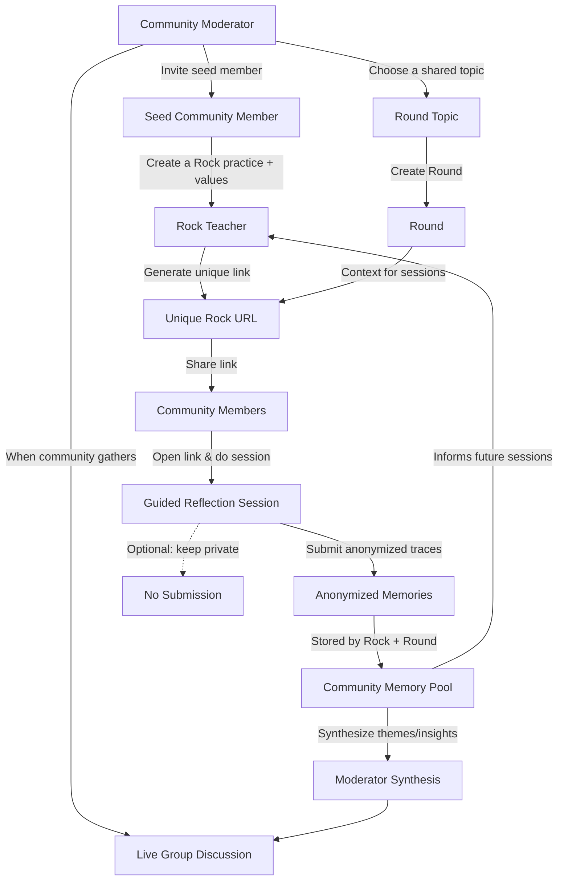

# Rock Talk: An AI-Mediated Community Garden for Collective Reflection and Purpose

**Cassandra Lee** (MIT Center for Constructive Communication, Cambridge, Massachusetts, USA)  
cass_lee@mit.edu • ORCID: 0000-0003-3422-4072

**Lars Thørvӓld** (The Thørvӓld Group, Hekla, Iceland)  
larst@affiliation.org

**Valerie Béranger** (Inria Paris-Rocquencourt, Rocquencourt, France)

**Aparna Patel** (Rajiv Gandhi University, Doimukh, Arunachal Pradesh, India)

**Huifen Chan** (Tsinghua University, Haidian Qu, Beijing Shi, China)

**Charles Palmer** (Palmer Research Laboratories, San Antonio, Texas, USA)  
cpalmer@prl.com

**John Smith** (The Thørvӓld Group, Hekla, Iceland)  
jsmith@affiliation.org

**Julius P. Kumquat** (The Kumquat Consortium, New York, USA)  
jpkumquat@consortium.net

---

## Abstract

From writing critique to setting goals, people increasingly turn to AI systems to support reflection and support in creative practice. However these interactions are most often done in solitary contexts with sycophantic models that have a tendency to reinforce existing beliefs, rather than support the active process of self-discovery. In contrast, we submit RockTalk: an AI-mediated rock garden which facilitates asynchronous wisdom sharing between creatives in a community. Through this installation, we open a window into AI co-journalling, a concept which challenges hyper-personalized AI experiences, and provides structure for creativity community building. By embedding AI within a tangible, natural, shared interface, Rock Talk proposes experiences with AI that reflect values of committment, shared history, and time - serving as a wide metaphor for the collective desire for stronger connection and real social care.

To do list

- Example transcript (meditation + interactive)
- Rock photographs
  - people interacting with the phone version of the dock (maybe in a bedroom)
- installation model
  - Rhino dock modelling
  - Installation modelling
- Section writing
  - Rock deisgn
- Flow diagram
- Header image
- Revisions (
- Submitting (Sun)

---

## CCS Concepts

- Do Not Use This Code — Generate the Correct Terms for Your Paper
- Do Not Use This Code — Generate the Correct Terms for Your Paper
- Do Not Use This Code — Generate the Correct Terms for Your Paper
- Do Not Use This Code — Generate the Correct Terms for Your Paper

---

## Keywords

Do, Not, Us, This, Code, Put, the, Correct, Terms, for, Your, Paper

---

## Teaser Figure


_Seattle Mariners at Spring Training, 2010._  
Enjoying the baseball game from the third-base seats. Ichiro Suzuki preparing to bat.

---

## Motivation

Artificial Intelligence (AI) has quickly crept into the most intimate pockets of our daily lives and creative practices. Creators report using large language models (LLMs) throughout the creative process from describing detailed work schedules to giving feedback \cite{}, but also for attending to the more emotional and spiritual aspects of creative practice, such as working through emotional roadblocks, and untangling the kinds of insecurities that come with creation \cite{}. Given that LLMs have a tendency to reinforce existing beliefs (i.e., sycophancy) \cite{(Cheng, 2025)}, provide whatever answer the user seeks \cite{NEEDED}, and promise spiritual salvation without being embedded in real supportive networks \cite{}, critical creative practitioners have begun asking if the influence of such a disemboded creative partner is worth the trade-off.

This questioning exists against the background of a pervaisive loniness epidemic, where creatives feel the looming problems of the loss of community, and spaces to gather. Forming creative community is especially important for working through the great emotional toles of creation \cite{}. In Julia Cameron's widely popular tome of creative practice, _The Artists Way_ \cite{cameron1993artist}, she highlights the need for sharing of guidance between artists of any kind: "QUOTE". Well-established forms of wisdom seeking, within and beyond creative practices are often done in community – for example circle practice, prayer, ritual. Relating your experiences and struggles to other humans is a profound and fundamental aspect of the human experience which affords the warmth of collective validation, reduces feelings of shame, keeps us accountable to our goals and values, and allows the creation of strong networks of resource sharing and mutual aid. Artists are particularly relient on community networks.

We are drawn to LLM guidance partially because it offers instantaneous answers, and doesn't require you to burden others with your problems. And yet does this convenient source of answers further isolate us, preventing us from building the collective wisdom skills that emerge from persuring questions of purpose, meaning, and creativity within collective? Never has a technology seemed so well suited to meet our aching desire for answers, and yet interacting with it evokes an ancient Zen Buddhist teaching: "If you meet the Buddha on the road, kill him."

In this work we seek to challenge this image of a solo person hunched over a chat window seeking life advice, and ask if interactions with an AI model necessarily need to draw away from collectivity. Rock Talk is a community wisdom garden which shares community-generated reflective practices through interactive chat-bots embedded in rocks. Figure X displays this multi-user system.

Our system is fundamentally physical and communal. By embedding AI into rocks, we hope to give users a sense of unity, provide a visual reminder of collective, and promote emotional value in the object users speak to – like the popular “pet rocks” trend.

Each rock in the shared collection represents a spiritual teaching or reflective activity, recommended by someone within the host's creative community, creating a shared resource of reflection grounded in the real people who make up the community rather than distant people lacking the specificities of your own creative community. Community members are invited to adopt these rock-teachers, and on their own explore the practice through a voice-only interaction deployed through a rock base. When finished with the rock, users return to garden, passing on some part of their session to the rock, allowing a person to learn from them. Communal events hosted at the garden allow collective engagement with the shared wisdoms, giving both asychonrous and sychonous moments to collectively reflect and open up.

In this installation, we share excerts from a proof-of-concept deployed within the artists own creative community, and give viewers a chance to experience the rock journalling practice hands on. By sharing this work with a broader audience, we ask: Can AI models meaningfully mediate community dialogue?

- core tension: AI as isolating vs AI as communal
- Limits of solitary AI interaction (reinforcement, echoing, extraction)
- Historical wisdom practices (circle practice, meditation, gardens)
- Philosophical grounding (Hume, collective moral reasoning)
- This is an artwork + system + ritual
- This project explores how AI-mediated rituals, grounded in physical space and structured by collective reflection, can reimagine purpose-seeking as a shared, ecological process rather than a solitary one.
- recover lost social rituals

---

## RockTalk: Design

RockTalk is designed as a community reflection ritual. It takes practices from constructive community work, like shared questions, mutual accountability, and care that builds over time, and turns them into a format people can do alone without leaving the group behind.

The interaction has two core ingredients: rocks and rounds. A rock is a facilitation stance. It is a teacher with a consistent voice and method for guiding reflection, such as gentle questioning, longer silences, or direct prompts. A round is a shared inquiry the group explores for a limited period and can revisit later. Think of a month spent with a topic like creative fear, rest, or commitment. People join a specific rock within a specific round through a simple link, which makes the practice easy to pass along.

During a session, the rock guides a short voice reflection that stays with the round topic. That constraint matters. It lowers the pressure to perform. It helps people avoid spiraling into open ended life advice. It also supports the steady pace of good facilitation: a question, a pause, then a return to the shared frame. In our pilot, the rock sometimes begins by placing the participant inside a collective field of attention before turning inward: “That’s a great insight. Getting familiar with the cold is a big step. Others have shared similar feelings, that gradual adaptation. What changes are you noticing in your body today, compared to when the storm first hit?” This kind of phrasing is deliberate. It gives the solitude of a personal session the faint but unmistakable presence of community, a reminder that the inquiry is being held by more than one person.

As the session unfolds, the rock keeps returning to lived sensation. It invites small, doable actions, then listens for what shifts. When the round theme risks becoming purely conceptual, the rock pulls it back toward concrete experience. In the pilot, when a participant described cold hands and dry winter air, the rock offered a simple experiment: “Try gently wiggling your fingers or rubbing your hands together. Notice if there’s even the tiniest shift in sensation.” This is the pedagogy of RockTalk. Not grand counsel. Not abstract reassurance. It is attention, practice, and the smallest measurable change.

Afterward, participants can review what was captured and, if they choose, contribute a few anonymized memories back to the round. These memories are gifts to future participants. They are brief traces of themes, emotions, and turning points that protect privacy while still offering companionship. As a round grows, it becomes a shared archive. The rock can acknowledge patterns by speaking in aggregates rather than quotations. It can say that others have been here too, without exposing anyone’s story.

RockTalk also includes a moderator role. The moderator curates rocks and rounds, then periodically synthesizes themes from the memories. This creates a path from private reflection to shared discussion. It mirrors constructive community practice where individual sense making becomes material for collective care. In this design, AI is not a replacement confidant. It is a structured mediator that helps a group hold questions together with patience.



---

## Installation

This installation of the Rock Talk concept gives viewers a window into the Media Lab rock garden of collective wisdom. Displayed as an interactive rock garden (figure X), viewers are invited to interact with unique rock personalities and listen to a curated chain of audio recordings made by past adopters of the rock.

Each rock in the collection is associated with a unique spiritual teacher by makers within the artist's real creative community. Each 10-15 minute looped audio track includes a reflection made by the recomender of the reflective practice, along with subsequent reflections made by adopters of the rock and practice. Key moments from this chain of reflections, along with actual prompts made by the AI model while in use allows audiences to consider the system as a whole (see figure X for an example of such a transcript).

To deepen the immersion within this multi-user system, a video monitor plays a looped video, showing clips from the individual and collective journalling experience. Additionally, viewers are invited into their own journalling session with one of the rocks in a semi-enclosed private environment.


_Sketch of the installation setup. Viewers are invited to listen to audio excerpts from the collective journalling experience on headphones._

### Concept

### Interaction Flow

The primary parameter given to the `acmart` document class is the _template style_ which corresponds to the kind of publication or SIG publishing the work. This parameter is enclosed in square brackets and is a part of the `documentclass` command:

```text
\documentclass[STYLE]{acmart}
```

- modular, scalable system
- rock display, listening
- screens showing interactions with rocks

### Summary

---

## Artist bios

Modifying the template --- including but not limited to: adjusting margins, typeface sizes, line spacing, paragraph and list definitions, and the use of the `\vspace` command to manually adjust the vertical spacing between elements of your work --- is not allowed.

---

## Acknowledgments

To Robert, for the bagels and explaining CMYK and color spaces.

---

## References

(From `sample-base` in ACM-Reference-Format; not included in provided text.)
